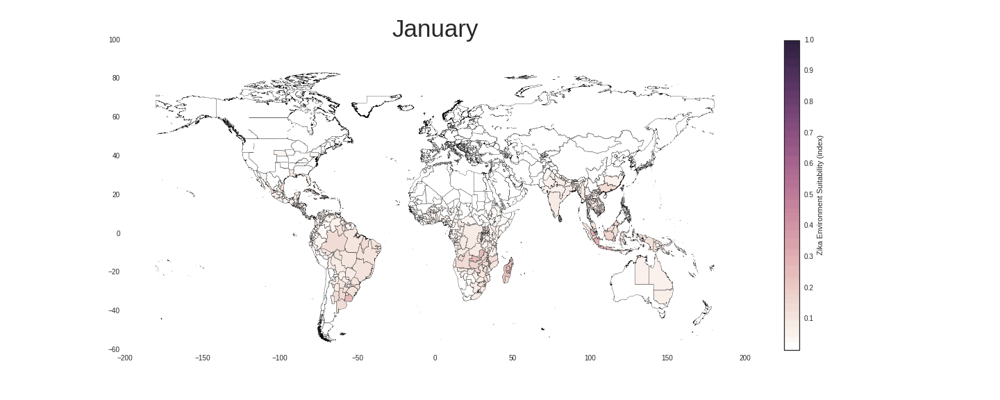
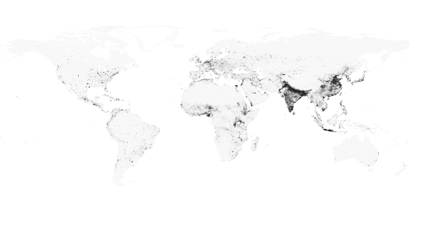

# Modeling and simulating the Zika outbreak under deep uncertainty

### Author Philipp Schwarz, MSc in Engineering and Policy Analysis
#### Delft University of Technology, The Netherlands
|    |            |
|----------|:-------------:|
| Chair of graduation committee: |  Prof. dr. Bartel A. Van de Walle |
| First Supervisor |  Prof. dr. Erik Pruyt |
| Second Supervisor |  Prof. dr. Michel Oey |

***In a Nutshell*** 

Large-scale simulation model to study worldwide potential Zika outbreaks. 
Methodological contributions: (1) Pulls in big (geo-referenced) data from different sources combining high-resolution raster data, census data and model-based predictions on global air travel (Mao et al. 2015) and Aedes Mosquito species distribution (Messina et al. 2016). (2) Account for deep uncertainty by sampling over high dimensional uncertainty space (3) Cope with seasonal dynamics by making use of monthly resolved exogenous data, (4) Ensure computational efficiency by switching from stochastic to differential equation-based model.

## Simulation input data
Simulation results are largelty driven by monthly resovled data about vector presence of Aedes Aegypti and Aedes Albopictus produced by Moritz Kraemer and Oliver Brady.

Centered text

 ###  Aedes Aegypti 

 ### Aedes Albopictus 

To address subnational heterogneity whenever possible as raw data high-resolution raster data rather than census data (on country level) was used. In the data preprocessing the raster data was transformed to vector data on the aggregation level needed for a fast global model. Similiar provinces within nations were clustered to single shapes.

Raw raster dataset         |  Vector data after pre-processing
:-------------------------:|:-------------------------:
  |   

## Preliminary Results
* Consistently over the complete ensemble of models, the recovery period (time human is infectious and can infect mosquito when being bitten) is the most important single variable that determines the speed of transmission and the Zika cases in the first wave of the global outbreak
* Travel plays a crucial role in the diffusion of the disease 
* The proposed integrated design method has proven to be useful to study Zika and could be applied with relatively little effort also to other vector-borne diseases such as malaria and dengue

## Please consider citing this Publication
Link to [Thesis](uuid:4957df8e-3de1-4b5e-8231-731287a4ede4) on http://repository.tudelft.nl/ 

## Future steps
Upcoming journal paper

## License
The MIT License (MIT)
Delft, The Netherlands
Copyright (c) 2016 Philipp Schwarz
